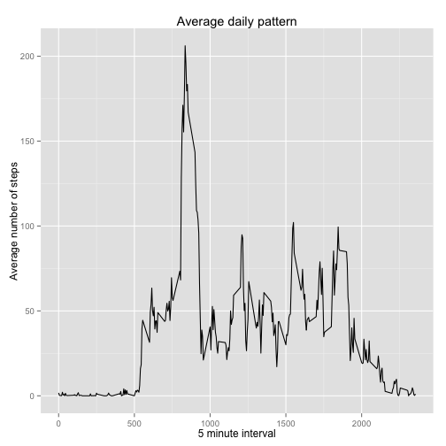
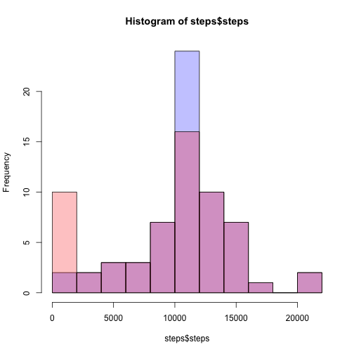
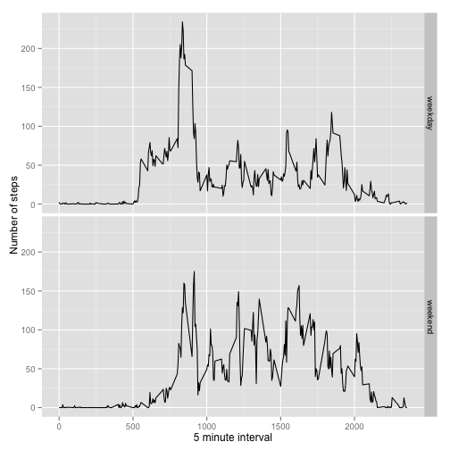

# Reproducible Research: Peer Assessment 1


## Loading and preprocessing the data


```r
unzip("activity.zip")
activity <- read.csv("activity.csv")
```


## What is mean total number of steps taken per day?


```r
library(reshape)
```

```
## Loading required package: plyr
## 
## Attaching package: 'reshape'
## 
## The following object(s) are masked from 'package:plyr':
## 
##     rename, round_any
```

```r
steps <- tapply(activity$steps, activity$date, sum, na.rm = TRUE)
steps <- melt(steps)
colnames(steps) <- c("Date", "steps")
p1 <- hist(steps$steps, breaks = 10, xlab = "Steps per day", ylab = "Count", 
    main = "Total number of steps taken per day")
```

 


```r
summary(steps$steps)
```

```
##    Min. 1st Qu.  Median    Mean 3rd Qu.    Max. 
##       0    6780   10400    9350   12800   21200
```


## What is the average daily activity pattern?


```r
library(ggplot2)
dpattern <- aggregate(steps ~ interval, data = activity, mean, na.rm = TRUE)
colnames(dpattern) <- c("interval", "avg.steps")
qplot(x = dpattern$interval, y = dpattern$avg.steps, geom = c("line"), xlab = "Average number of steps", 
    ylab = "5 minute interval", main = "Average daily pattern")
```

 


```r
dpattern[which.max(dpattern$avg.steps), ]
```

```
##     interval avg.steps
## 104      835     206.2
```

## Imputing missing values


```r
missingvals <- is.na(activity$steps)
```

The total missing values in the activity data set is 2304


```r
fillvals <- function(steps, interval) {
    if (!is.na(steps)) {
        return(steps)
    } else {
        return(dpattern[dpattern$interval == interval, "avg.steps"])
    }
}
activity$steps.v2 <- mapply(fillvals, c(activity$steps), activity$interval)
```


```r
steps <- tapply(activity$steps.v2, activity$date, sum, na.rm = TRUE)
steps <- melt(steps)
colnames(steps) <- c("Date", "steps")
p2 <- hist(steps$steps, breaks = 10, xlab = "Steps per day", ylab = "Count", 
    main = "Total number of steps taken per day (filled)")
```

 


```r
summary(steps$steps)
```

```
##    Min. 1st Qu.  Median    Mean 3rd Qu.    Max. 
##      41    9820   10800   10800   12800   21200
```


Mean and median are higher. If we compare with the previous histogram, we notice that we are removing all the zero values given by the missing values, and replacing by the mean of the given interval.


```r
plot(p2, col = rgb(0, 0, 1, 1/4), xlab = "Steps per day", ylab = "Count", main = "Total number of steps taken per day")
plot(p1, col = rgb(1, 0, 0, 1/4), add = TRUE)
```

 

The main effect is in the bins arround the zero values and the the bins arround the mean value.

## Are there differences in activity patterns between weekdays and weekends?

First we create the new factor variable week with two leves: weekend and weekday


```r
weekdays.factors <- weekdays(as.Date(activity$date))
activity$week <- factor(by(weekdays.factors, 1:length(weekdays.factors), function(row) {
    if (row %in% c("Saturday", "Sunday")) {
        return(c("weekend"))
    } else {
        return(c("weekday"))
    }
}))
```


```r
dpattern <- aggregate(steps ~ interval + week, data = activity, mean, na.rm = TRUE)
qplot(interval, steps, data = dpattern, geom = c("line"), facets = week ~ ., 
    xlab = "5 minute interval", ylab = "Number of steps")
```

 

